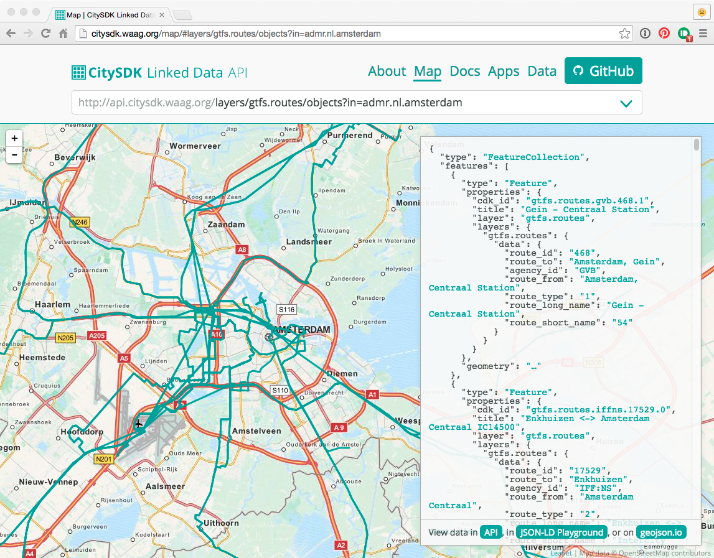

The CitySDK Linked Data API offers unified and direct access to open transport, mobility and general data from government, commercial and crowd sources alike. It is designed to work closely with other open source projects as [OpenTripPlanner](http://www.opentripplanner.org/), [OpenTripPlanner Analyst](http://www.opentripplanner.org/analyst/), [Open311](http://www.open311.org/), [GTFS](https://developers.google.com/transit/gtfs/reference), and [OpenStreetMap](http://www.openstreetmap.org/#map=16/52.3726/4.9002).

In the CitySDK Linked Data API, data sets are called `layers`. Each layer can contain `objects`, and each `object` contains, per `layer`, key/value `data`. In the API, _real-world objects_ like buildings, bus stops and municipalities are represented by `objects`, which can contain `data` on one or more `layers`. This way, multiple data sets can tell something about one single `object`.

The `master` branch of this repository contains the API — written using Ruby, [Grape](https://github.com/intridea/grape) and PostGIS — the [`gh-pages`](tree/gh-pages) branch contains the project's website.

For more information about the CitySDK LD API, see the project's [website](http://citysdk.waag.org) or [wiki](../../wiki).

- A Ruby gem for easy programmatic access to the CitySDK LD API is available in the [`citysdk-rubygem`](https://github.com/waagsociety/citysdk-rubygem) repository,
- And in the [`citysdk-amsterdam`](https://github.com/waagsociety/citysdk-amsterdam) repository, you can find importers for Amsterdam-specific data sets.
