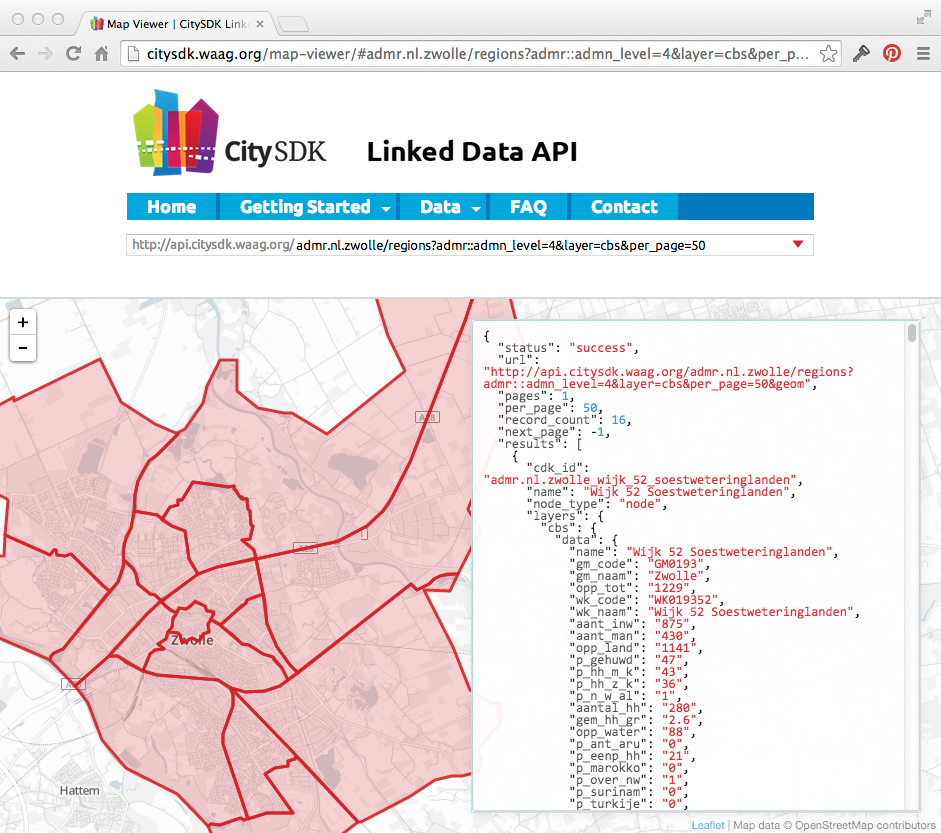

# CitySDK LD API v1.0

An API to share data about small and big cities, linked to objects in the real world. Data can be official and authorative as well as crowd sourced. 

This is the working repository for CitySDK LD API v1.0. For more information about the CitySDK LD API, see the [website](http://citysdk.waag.org) or [wiki](../../wiki).

